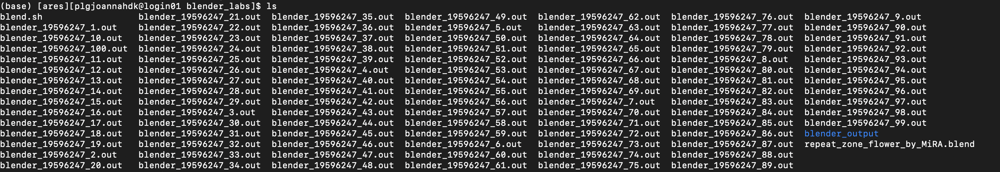
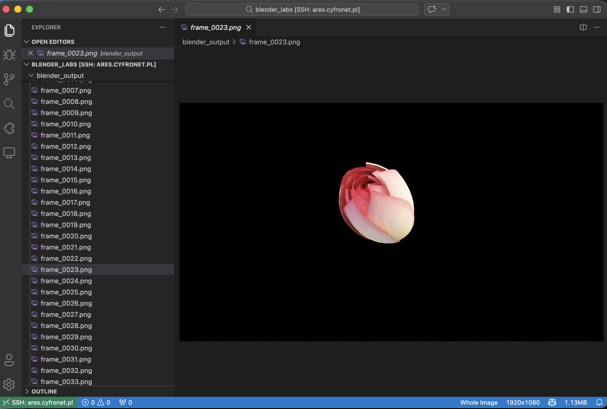
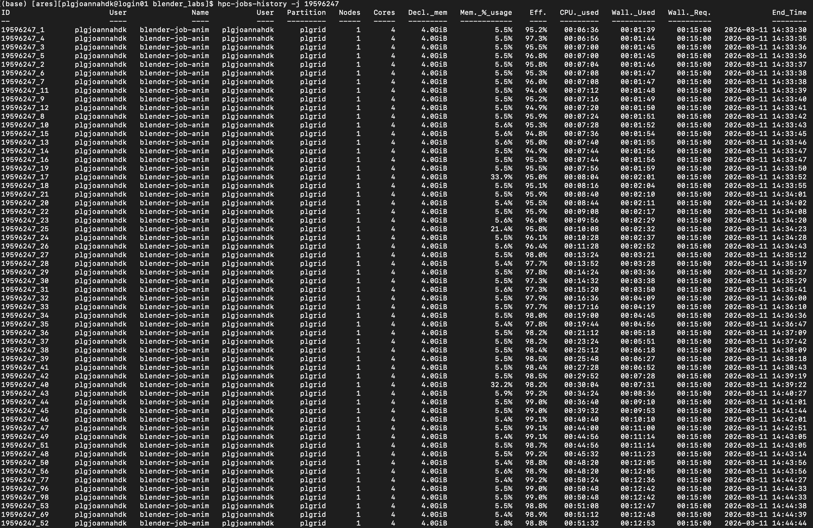
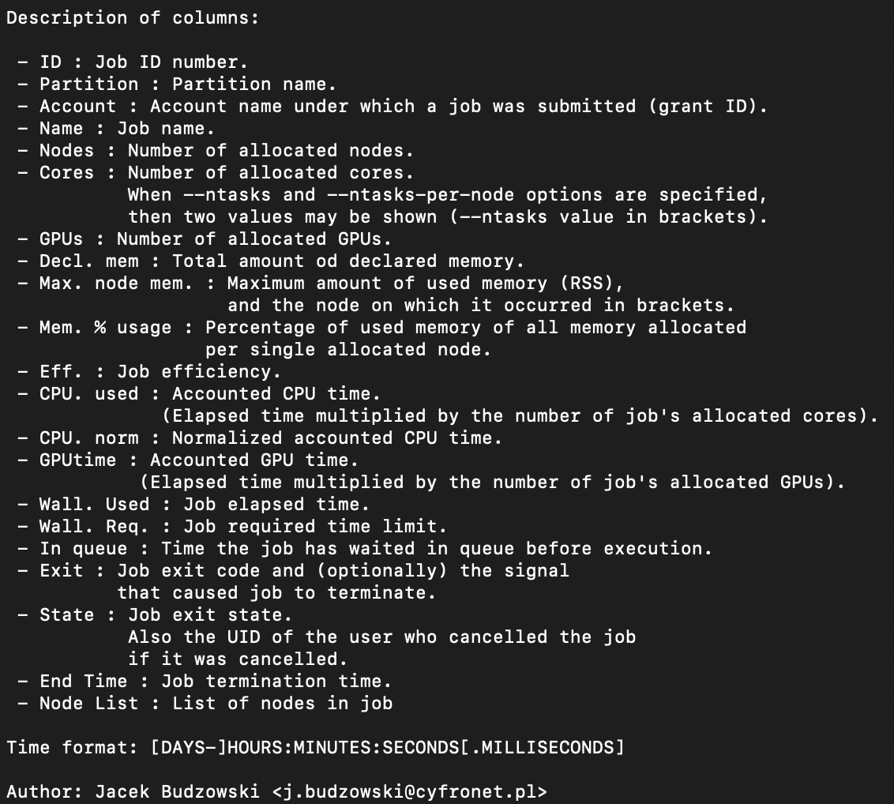
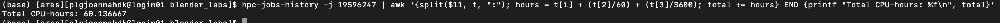

## 1)
After running blender script:
```bash
#!/bin/bash
#SBATCH --job-name=blender-job-anim
#SBATCH --output=blender_%A_%a.out 
#SBATCH -p plgrid
#SBATCH -A plglscclass26-cpu
#SBATCH -N 1
#SBATCH --ntasks-per-node=4
#SBATCH --mem-per-cpu=1GB
#SBATCH --array=1-100
module load blender

BLEND_FILE="repeat_zone_flower_by_MiRA.blend"
OUTPUT_PATH="./blender_output/"
OUTPUT_FORMAT="PNG"

n=${SLURM_ARRAY_TASK_ID}

# Render the animation using Blender's command-line interface
blender -b "$BLEND_FILE" -o "${OUTPUT_PATH}frame_" -F "$OUTPUT_FORMAT" -f "$n"

# Notify completion
echo "Rendering completed. Check the output at $OUTPUT_PATH"


```
I got such output files:

And rednered images of the animation:


## 2)
Result of the `hpc-jobs-history` command: 


Later conclusions in 2) and 3) are based on the  legend of the hpc-jobs-history command output below:

The CPU efficiency was excellent, ranging from 94.6% to 99.3%. Blender utilized all the available CPUs almost completely.
## 3)
From column CLU_used we can see how much CPU time was used for each frame. After adding all these values together:
```bash
hpc-jobs-history -j 19596247 | awk '{split($11, t, ":"); hours = t[1] + (t[2]/60) + (t[3]/3600); total += hours} END {printf "Total CPU-hours: %f\n", total}'
```
We get value around **60 CPU-hours used for whole animation**

