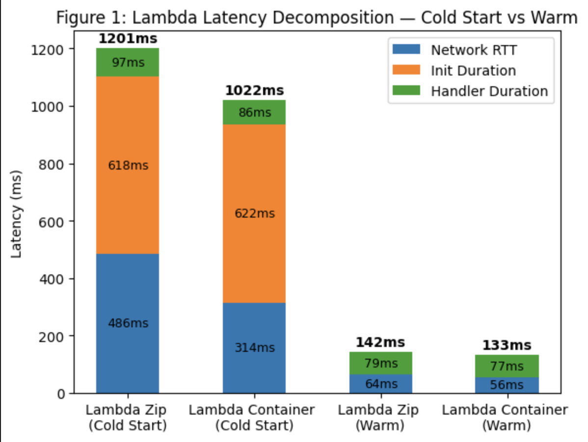
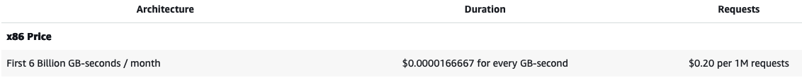
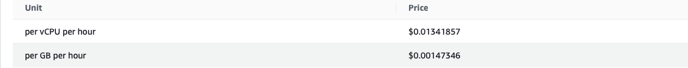
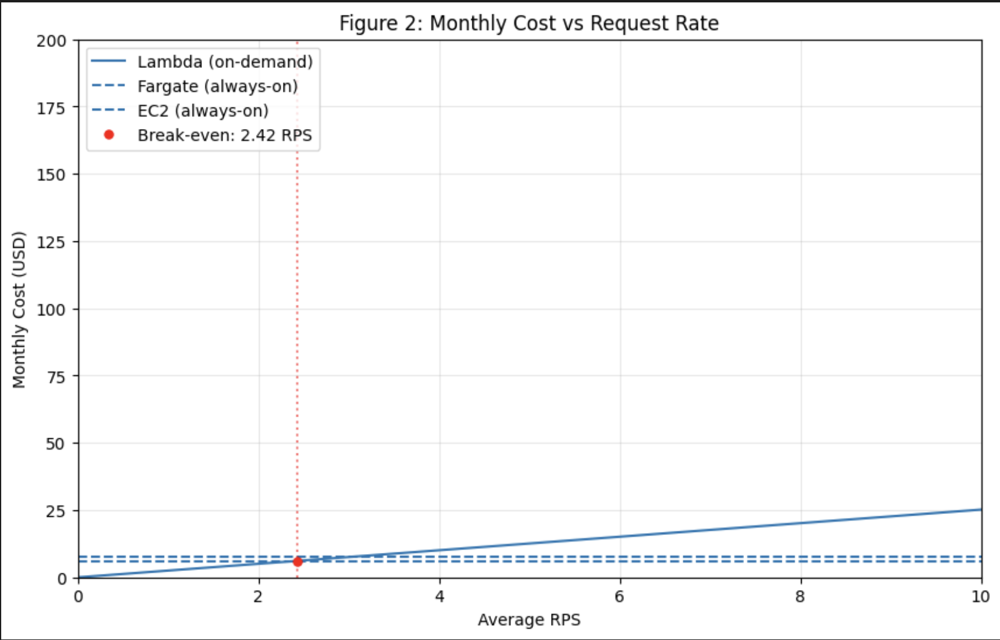

## Assignment 1
I deployed all 4 environments and got the same results arrays. They can be checked in [assignment 1](assignment-1-endpoints.txt)
## Assignment 2
I saved the CloutWatch Logs reports from cold and warm starts in files for: [Lambda Zip](scenario-a-zip-duration.txt) and [Lambda Container](scenario-a-container-duration.txt). 

I got the cliend-side total latency from oha logs for [Zip Run](scenario-a-zip.txt) and [Container Run](scenario-a-container.txt) for cold start I used Slowest latency and for warm start I used Fastest latency.

I calculated RTT for each of the starts on each environment in the notebook: [script file](figures/scripts_for_figures.ipynb) and obtained the following stacked bar chart:

Against the consious conclusions, we can observe that the container deployment has a faster cold start than the zip deployment. This may be caused by AWS optimizations on the process of pulling container images from ECR. Also, the container images are buil in layers, so maybe some of the layers can be cached and only part of the app need to be fetched at the time, when a zip archive must be fully downloaded and unzipped every time which can be less efficient.

## Assignment 3
| Environment | Concurrency | p50 (ms) | p95 (ms) | p99 (ms) | Server avg (ms) |
|---|---|---|---|---|---|
| Lambda (zip) | 5 |95.22 | 111.97| 118.94| |
| Lambda (zip) | 10 | 92.58|109.52 | 128.18	| |
| Lambda (container) | 5 |93.36 | 109.62| 125.42| |
| Lambda (container) | 10 | 88.68| 108.56| 119.84| |
| Fargate | 10 | 792.40| 1003.60| 1099.20| |
| Fargate | 50 | 3914.10| 4197.00|4386.60 | |
| EC2 | 10 | 189.31| 255.12| 302.33| |
| EC2 | 50 | 919.70|2837.70 | 3012.40| |

- There in no row where 99 > 2× p95, which signals there is no tail latency instability
- Based on the technical reference: In this lab, a single Fargate task handles all requests. Although Flask's dev server is multi-threaded by default (since Flask 1.0), concurrency is still limited by the GIL and available CPU. At concurrency=50, queuing and CPU contention become the dominant latency factors — not per-request compute.  
The t3 family uses CPU credits for burstable performance. The baseline is 20% of 2 vCPUs. During the k-NN computation (~23ms per request), a single request uses well under the baseline, so credit consumption is minimal. Under burst (c=50), concurrent requests contend for the GIL and CPU, but per-request CPU usage remains constant.  
Lambda creates one execution environment per concurrent request. If 50 requests arrive simultaneously and only 10 warm environments exist, Lambda provisions 40 new ones (each with a cold start).


## Assignment 4
The results for latency distribution for each target are in files: scenario-c-*.txt while the cold start entries from CloudWatch are here for [Container Lambda](variant-c-init-duration_container.txt) and [Zip Lambda](variant-c-init-duration_zip.txt).  
The result table for latencies for each environment is below:
| Environment | Concurrency | p50 (ms) | p95 (ms) | p99 (ms) |
|---|---|---|---|---|
| Lambda (zip) | 10 |96.8 |1152.5 |1194.5 |
| Lambda (container) | 10 |92.7 | 866.8 | 1039.8 |
| Fargate | 50 | 3897.5| 4189.3| 4272.1| 
| EC2 | 50 | 1034.6|1034.6|1140.1 | | 

- Based on the table, Lambda's p99 latency is significantly lower than Fargate's, though comparable to EC2's in this specific test
- The bimodal distributions occur for both: Zip and Container Lambda, we can see for both the peaked latency between p50 and p90. This happens because Lambda creates one execution environment per concurrent request. If 50 requests arrive simultaneously and only 10 warm environments exist, Lambda provisions 40 new ones (each with a cold start) as Techincal Reference states.
- The Lambda does not meet the p99 < 500ms SLO under burst for both: Container and Zip. To fulfill SLO, we would need to use Provisioned Concurrency for keeping specific biger amound of execution environmens "warm" all the time.

## Assignment 5
Lambda charges $0.20 per 1 million requests and $0.0000166667 per GB-second


Fargate charges hourly for allocated vCPU ($0.01341857) and memory ($0.00147346/GB):

We use: ECS Fargate (behind ALB)	0.5 vCPU / 1 GB. 

EC2 on-demand pricing for t3.small in us-east-1: $0.0104/hour.

We use: t3.small (2 vCPU, 2 GB) with 20 GB storage. 

Calculations for Lambda:
```
Hourly Idle Cost = $0
Monthly Idle Cost = $0
```
Calculations for Fargate:
```
Hourly Idle Cost = 0.5*$0.01341857 + 1*$0.00147346/GB = $0.008182745/h
Monthly Idle Cost = 30[dni] * 24[godzin] * $0.008182745/h = $5.8915764
```
Calculations for EC2:
```
Hourly Idle Cost = $0.0104/h = 
Monthly Idle Cost = 30[dni] * 24[godzin] * $0.0104/h = $7.488
```
The Lambda environment has zero idle cost as you pay there for requests and compute time, not for just being.

## Assignment 6
Firstly let's calculate the total amount of monthly requests:
```
100 RPS*60*30*30[dni] = 5 400 000
5 RPS*60*30*60*5.5*30[dni] = 2 970 000
Total nmbr of req per month: 8 370 000
```
Lambda costs:  
Using the p50 duration of 92.58ms (0.09258s) from the Lambda Zip c=10 test and 0.5 GB memory.
```
Monthly cost = (8 370 000 × $0.20/1M) + (GB-seconds/month × $0.0000166667)
GB-seconds   = 8 370 000 requests × 0.09258 s × 0.5 GB
So:
Monthly cost = $8.133
```

Fargate Costs is just copy from previous calculations in Ass 5 so:
```
Monthly cost = $5.8915764
```

EC2 costs are also a copy from previous calculations:
```
Monthly cost = $7.488
```

Calculating the break-even point:  
Monthly Fargate Cost is always $5.89 regardless of traffic.
```
Nmbr of Scnds in Month = 2592000
Total Monthly Requests = RPS * 2592000

Requests Cost = (RPS × 2 592 000 / 1 000 000) × $0.20 = RPS × $0.5184
GB-seconds   = RPS × 2 592 000 × 0.09258s × 0.5 GB = RPS × 119 959.2
Compute Cost = RPS × 119 959.2 × $0.0000166667 = RPS × $1.9993
Total Lambda Cost = RPS × ($0.5184 + $1.9993) = RPS × $2.5177


So:
$5.89 = RPS * 2.5142 => RPS = 2.343 RPS
```
The break-even point is reached at an average traffic volume of approximately 2.34 RPS.

The plot showing the pricign comparison:


### Recommendations

**Use AWS Lambda (Container version)**
 Lambda is fast enough most of the time (almost instant responses), but when many requests come at once, some get stuck waiting and become too slow. To fix this, pay a tiny extra $0.13 per month to keep 10 "ready-to-go" Lambda servers always waiting. This keeps the service fast even during traffic spikes. Fargate and EC2 are too slow (4-6 times slower than needed) and would cost much more to fix.
